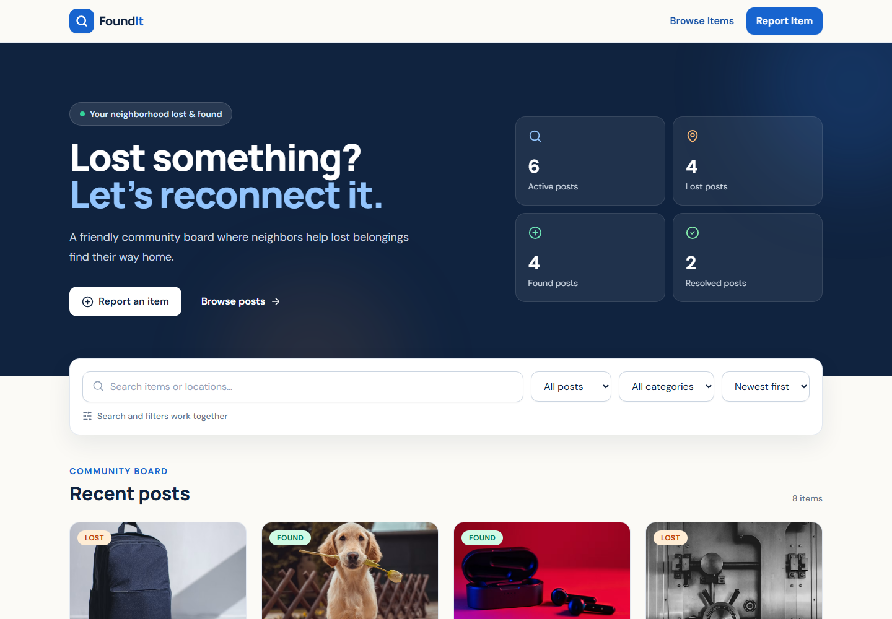
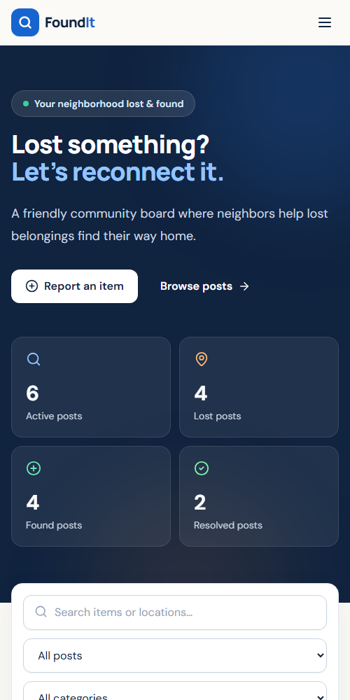

# FoundIt — Community Lost & Found Board

## Live Demo

https://temporary-swift-dune-0529hzk.vercel.app

FoundIt is a responsive community board that helps lost belongings find their way home. Visitors can browse local reports, search and filter the collection, publish a lost or found item, and mark a successful match as resolved. The application is intentionally frontend-only and saves its state in the browser.

## Live project

- **Live application:** [temporary-swift-dune-0529hzk.vercel.app](https://temporary-swift-dune-0529hzk.vercel.app)
- **GitHub repository:** [github.com/lana-268/FoundIt](https://github.com/lana-268/FoundIt)

## Target users

FoundIt is designed for students, neighbors, commuters, venue staff, and other community members who have either lost a personal belonging or found something that may belong to someone nearby. The interface is public, friendly, and simple enough to use without creating an account.

## Main user actions

1. Browse recent lost and found reports.
2. Search by title, description, or location.
3. Combine Lost/Found and category filters, then sort by date.
4. Open a report to see its full description and contact information.
5. Report a lost or found item with a photo, location, date, email, and phone number.
6. Mark an item as resolved when it has been returned.
7. Refresh or revisit the site without losing locally saved changes.

## Full feature list

- Eight realistic starter reports across multiple categories and locations
- Responsive desktop, tablet, and mobile layouts
- Search across item titles, descriptions, and locations
- Lost/Found type filter and category filter
- Newest/oldest sorting and one-click filter reset
- Dynamic active, lost, found, and resolved statistics
- Dedicated item-details route with a friendly missing-item state
- Lost, Found, Active, and Resolved visual badges
- Accessible report form with visible labels and inline validation
- Validation for title, description, date, URL, email, and phone number
- Local image upload with type/size checks, preview, and removal
- Optional remote image URL as an alternative to uploading
- Status updates and new reports persisted with `localStorage`
- Loading, empty, storage-error, and success feedback states
- Responsive navigation and shared footer
- Keyboard focus styles, semantic HTML, image alternative text, and ARIA feedback
- Automated React Testing Library test for search behavior
- Refresh-safe client-side routes in the Vercel deployment

## Screenshots

### Desktop



### Mobile



## Technology

- React 18 and strict TypeScript
- Vite
- Tailwind CSS
- React Router v6
- React Hook Form and Zod
- Lucide React icons
- Vitest and React Testing Library
- Browser `localStorage`

## Student-chosen feature: local image upload

The student-chosen enhancement is direct image upload on the report form. A user can select a JPG, PNG, WebP, or GIF, preview it before submitting, and remove it if necessary. The prototype limits files to 1 MB and converts the selected image to Base64 so the complete report can persist locally without a backend.

This approach is appropriate for a small classroom prototype, but browser storage is limited. Several uploads can eventually fill `localStorage`. In a production version, images would be uploaded to cloud object storage and only their URLs would be saved in the application database.

## AI prompts used during development

1. **Initial build prompt:** “Build a complete, polished React and TypeScript frontend application called FoundIt, a community Lost and Found Board, with browsing, filtering, reporting, resolution, persistence, and one automated test.”
2. **Image enhancement prompt:** “I want to be able to upload an image.”
3. **Contact enhancement prompt:** “For the contact, an email address is not enough; add a phone number also.”

AI-generated suggestions and code were reviewed, adjusted to match the project scope, and verified with TypeScript, automated tests, and a production build.

## Local development

Requirements: Node.js 18 or newer and npm.

```bash
git clone https://github.com/lana-268/FoundIt.git
cd FoundIt
npm install
npm run dev
```

Open the local URL printed by Vite, normally `http://localhost:5173`.

## Verification

```bash
npm run typecheck
npm test
npm run build
```

## Deployment instructions

The project is configured for Vercel with `vercel.json`. Its rewrite sends every application route to `index.html`, allowing direct visits and refreshes on routes such as `/items/blue-backpack` without a hosting 404.

To deploy from the command line:

```bash
npm install
npm run build
npx vercel --prod
```

Alternatively, import the GitHub repository in Vercel and use these settings:

- Framework preset: Vite
- Build command: `npm run build`
- Output directory: `dist`

## Project structure

```text
src/
  components/        Shared layout, feedback states, and badges
  features/items/    Item data, types, persistence, context, and cards
  pages/             Browse, details, report, and not-found pages
  test/              Vitest environment setup
  App.tsx            Route composition
  main.tsx           Application entry point
screenshots/          Desktop and mobile project screenshots
vercel.json          SPA route fallback for production hosting
```

## Data and persistence

On the first visit, FoundIt seeds eight mock reports. New reports and resolved statuses are saved under `foundit-items-v1` in the browser's local storage and restored after refresh. Storage and malformed-data failures are allowed to reach the item context, which displays an error message and retry action instead of silently hiding the problem.

No authentication, backend, database, payment, maps, or messaging service is required.

## Reflection

### Most difficult technical decision

The most difficult decision was how to persist uploaded images while keeping the application frontend-only. Saving Base64 data in `localStorage` made the feature possible without adding a backend, but it required a strict file-size limit and a clearly documented storage tradeoff. For this prototype, simplicity and assignment scope were more important than production-scale storage.

### Where AI helped most

AI helped most with turning the requirements into a clear component architecture and checking that all states were represented: loading, success, empty results, invalid routes, form errors, and storage errors. It also accelerated the first version of the typed form schema and search test.

### Which AI suggestion I rejected or modified

The initial contact design used one generic `contactMethod` input that accepted either an email address or a phone number. I modified that design because community members benefit from having both options. The final form has separately validated email and phone fields and displays both on the details page.

### What I would improve with more time

I would add a real backend with user accounts, cloud image storage, report moderation, and cross-device synchronization. I would also add more automated tests for form validation and persistence, image compression before upload, editable reports, and stronger end-to-end accessibility testing.
